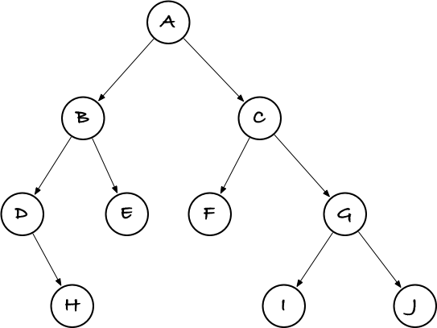
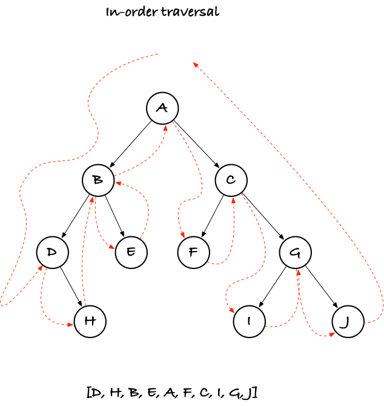
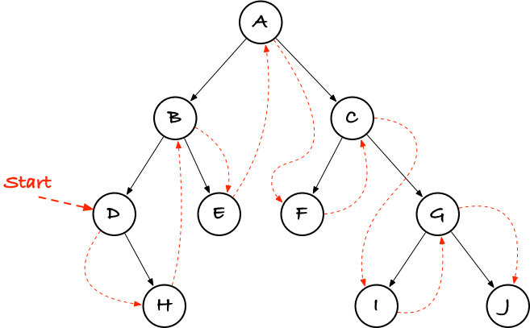
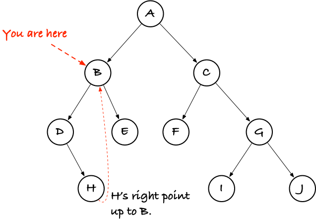

# Tricks for avoiding (function call) recursion when you actually need recursion

Recursion is cool. It helps us organise data (in recursive data structures) and solve problems (with divide-and-conquer) and is just generally a great tool for program. However, if you implement recursive functions, there is a cost to it. Not unique to recursion, true, but it mostly manifests there. Function calls require stack frames, stack frames take up memory, and the particul problem is that stack frames tend to end up on the stack which has a fixed memory size. Exceed it, and your program crashes.

In a modern interpreted language like Python or R, you might get a nice error message like `RecursionError: maximum recursion depth exceeded`, but if you are running binary code there is little information about what went wrong. The OS just kills your program because it is accessing memory that it isn't allowed to (and it isn't allowed to access the memory beyond the stack). The details here are quite interesting, but beyond what we will talk about today.

There are various tricks that you can do to avoid this problem. As with all programming tricks, which you should choose depends partly on taste and partly on application. I will show three tricks below. The application we will work with is almost trivial, but complex enough to illustrate the ideas. It isn't far from a case you might need to handle in the wild, however, as it closely resembles a problem you will run into if you use suffix trees to search in strings (and if you take GSA you will know what I'm talking about; if you haven't, then take GSA so you can learn some useful skills for once).

But first, let's look at ways we could implement recursion.

## Ways of doing recursion

Let's start with one of the simplest recursions I can think of, computing the factorial of `n`, `n! = n * (n - 1) * ... * 2 * 1`. It has a nice and recursive definition so it translates directly into a recursive function as well. A direct recursion is one that just calls recursively when we normally would, and a Python implementation of the factorial could look like this:

```python
def direct(n: int) -> int:
    return n if n == 1 else n * direct(n - 1)
```

If we think of what has to happen when we run this function, and what has to sit on the stack, the `n * direct(n - 1)` bit tells us that before we can return we need to know the result of the recursive call. We need to remember `n`--and we only have the stack to store `n` in--so we need to keep the stack frame for the first call until all the recursive calls are done, and only then can we compute the final value.

A *tail recursive* function is one where we do not need to remember anything when we make a recursive call, because the function immidiately returns the value it gets from the recursion. A tail-recursive factorial can look like this:


```python
def tail_recursion(n: int, acc: int = 1) -> int:
    return acc if n == 1 else tail_recursion(n - 1, n * acc)
```

In the recursive call, we just return the result of the recursion. We use an accumulator to do the calculations as we go down the recursion, so we don't have to do it when we return. We don't strictly need the first function's stack frame any longer when we make the recursive call, so the memory we use for that stack frame can be taken over by the next call.

This isn't isolated to recursion; whenever you have a function that immidiately returns the result of another function call

```python
def f(x, y):
    return g(x) if x else h(y)
```

the `f` stack frame isn't needed after we call another function, and we we generally call these kinds of case *tail-calls*.

Tail calls can be turned into loops, and this is particularly simple for tail-recursive functions. Here is a loop-version of the factorial function:

```python
def loop(n: int) -> int:
    acc = 1
    for i in range(1, n + 1):
        acc *= i
    return acc
```

You can always turn a tail-recursive function into a loop, and you can actually do it with tail-calls in general (althought it is a bit more complicated). Many programming languages do this automatically, e.g. Haskell or SML, while others typically do, depending on compiler optimisation, e.g. C or Go. Some languages have decided not to do it, e.g. Python or R, and they have their reasons for that, but it forces us to always do the transformation ourselves when we need it.

When you have a recursive function that only calls itself once per execution, you can generally translate it into a tail-recursive version, and then translate that into a loop. With a little experience, this becomes second nature.

It is not as easy if you have functions where you need to recurse more than once. Then the simple transformation is not simple at all, but it is of course that case we will consider here.

A final way of doing recursion is so-called *continuation passing style*. Here, you use a function to do what the accumulator does in a tail-recursive call. This function, called the *continuation* is one you must call when you are done with your computation, and if you make a recursive call and want something done when the recursion is done, you must provide a continuation to the call.

The factorial, writen in continution passing style, can look like this:


```python
def cps(n: int, k: Callable[[int], int] = lambda n: n) -> int:
    return k(1) if n == 1 else cps(n - 1, lambda res: k(n * res))
```

Continuation passing style is more complex to do, and it takes some experience to wrap your head around it, but it is a technique that you can use to translate *any* recursive function into a tail-call.

This is great if your langauge implements the tail-call optimisation, then you just need to write CPS code and you will never have to worry about running out of stack space. If you are not using such a language, however, there is a little bit more to do.

Let's get to a (slightly) more complicated example.

## Traversing a tree

The simplest case that I can think of that requires more than one recursive call is a tree traversal, so consider a tree such as this:



To keep it simple, it is a binary tree, and in Python we could implement it like this:

```python
@dataclass
class Node(Generic[T]):
    """Inner node of a tree."""
    value: T
    left: Tree[T] = None
    right: Tree[T] = None

# A tree is either a Node or None
Tree = Optional[Node[T]]
```

and construct the specific tree from the figure as:

```python
tree = Node(
    'A',
    Node('B', Node('D', right=Node('H')), Node('E')),
    Node('C', Node('F'), Node('G', Node('I'), Node('J')))
)
```

There are many ways to traverse a tree, but I am interested in "in-order" traversal, where you first traverse the left sub-tree, then visit a node, and then traverse the right sub-tree.



If this was a binary search tree, an in-order traversal would visit the nodes in increasing order. This tree isn't supposed to be a search tree as such, I just chose in-order travesal because it will illustrate some of the problems we might run into, if we want to traverse the tree without recursion.

But before we do that, let's just traverse it *with* a direct traversal.

```python
def inorder(t: Tree[T], acc: list[T] | None = None) -> list[T]:
    """Inorder traversal of a tree."""
    acc = acc if acc is not None else []
    if t:
        inorder(t.left, acc)
        acc.append(t.value)
        inorder(t.right, acc)
    return acc
```

Let's consider our options for alternatives to direct recursion. Can we make the traversal tail-recursive (and then into a loop)? That is not immidately obvious; since we make two recursive calls we could make one of them into a tail-call but not both.

The problem is that after the first recursive call we need to go back to the current frame to append the node's value and then we can make the second call (which could be a tail-call if we wanted it so).

It is these points between function calls that we call continuations in CPS. "First make a recursive call on the left, after that *continue* with appending the current node and then *continue* with the right recursive call."  CPS makes this explicit and a continuation passing style version could look like this:

```python
def cps(t: Tree[T], k: Cont[T] = lambda x: x) -> list[T]:
    if t is None:  # Base case, continue (call k) with an empty list
        return k([])

    def handle_value_and_right(left: list[T]) -> list[T]:
        def handle_right(right: list[T]) -> list[T]:
            return k(concat(left, right))
        left.append(t.value)
        return cps(t.right, handle_right)

    return cps(t.left, handle_value_and_right)
```

Ignoring the base case, we need to call recursively on the left (the last line). We have two points we have to handle after we have the result from the left case, the two continuations, and the first of these is implemented in the function `handle_value_and_righ()`. When we call `cps(t.left, handle_value_and_right)` we are saying that this function should be called when we are done with the recursion on the left. The `handle_value_and_right()` function will be called with the result from the first recursion and it is responsible for what happens after that. It needs to append `t.value` and the recurse to the right, and the second recursion needs to know what to do once it is done, so we have to give it a continuation. That continuation is `handle_right()`, which will be called with the list we get from the second recursion. It will concatenate (in constant time, don't worry) the list from the left and from the right, and then it should return, which means that it calls the continuation `k` that the `cps()` function got.

Yeah, I know it looks complicated, but you get used to it after a while, if you muck about with these things long enough.

All the calls (except for `left.append(t.value)` which is constant time anyway) are tail calls, so if Python optimised these, we would only use space for one single stack frame and not a stack frame for each call.

Python doesn't, so this rewrite didn't get us anywhere. Except that there is another trick that solves the problem, but I will get to that a little later.

First, let's give up on (explicit) recursion and try an explit stack instead.

I can't count how many times I've heard people say "just use an explicit stack". I don't think the people saying that have ever tried it themselves. It is not as trivial as it sounds. But it is true, of course, that if we can implement something with a recursion stack, then we should also be able to use our own stack, and put the information that our function needs there. This doesn't reduce the memory that we need (necessarily), but when we use our own stack it sits on the heap and not on the stack, and that means that we can reallocate memory to grow it, and there is usually lots more memory on the heap than on the stack.

To move the recursion stack into the heap we need to make it explicit, we need to pop stack frames off it and push new frames onto it, and then we need a loop of some sorts to handle the computation.

A straightforward implementation could look like this:

```python
def stack_traversal(t: Tree[T]) -> list[T]:
    stack = [t]
    res = []
    while stack:
        t = stack.pop()
        if t:
            stack.append(t.left)
            res.append(t.value)
            stack.append(t.right)
    return res
```

It is relatively simple, simpler than the CPS solution at least, and it closely follows the direct recursion.

It doesn't work, though.

Oh, it will traverse the tree just fine, but not in the order we want, and we *want* an in-order traversal.

The problem is that pushing something on the stack doesn't automatically get all the computations done. You need to pop it out again and do the calculations. The order in which things happen are very different when you *call* a function or when you *push a frame*. that is what makes "just use an explicit stack" such a dumb thing to say. There is more work involved than that. You end up having to deal with each of the continuations in the CPS solution; between each function call, there is work to be done, and you must jump to the right block of code, do what you have to do, and then make sure that the right code is run after that.

I have put an implementation in `python/trees.py`, but before you look at it, I encourage you to try implementing it yourself. Some day, you might have to use an explicit stack, so it is a good skill to know.

**Exercise:** Implement an in-order traversal without recursion, but using an explicit stack.

(I made it look very difficult there, but it really isn't. In this case you can easily get it to work. My point was just that it is not *trivial* and that the things you need to deal with with an explicit stack are all the things you would also need with CPS but never worry about with a direct recursion).

## Thunks and trampolines

For an in-order traversal, an explicit stack is the right solution. It is simple, once you get the control flow right, and with a good stack implementation it is very efficient. But things can get a lot more complicated than this. You might have to traverse one tree, then for each node traverse another tree, for each pair of nodes do something complicated, and so on and so on... along the way, you have to keep track of where the program is at any time. If you are used to the normal function call mechanism for keeping track of the program's state, you are underestimating how much bookkeeping there is, but if you have to implement it using an explicit stack, you will soon find out.

While continulation passing stile is more complicated than normal function calls, it does break what you have to do into small pieces that you can handle independently, and if you have to mix lots of different recursive traversals, you can still do this with simple building blocks, unlike if you have to store all the state in a stack you manage yourself.

What I am trying to say is that you shouldn't write off CPS too quickly.

CPS is often a bit slower than explicit stacks and a state-machine like the one we used with the stack, and with the trick below it is slower still, but from a programmer perspective it is much faster to code, and that matters as well. So, let's find out how we can use it, if the language we are programming in doesn't optimise tail calls.

Before that, though, I will refactor the `cps()` function a bit, pulling out the inner functions and making generator functions for them instead:

```python
def handle_right(left: list[T], k: Cont[T]) -> Cont[T]:
    """Make the 'go right' continuation."""
    def cont(right: list[T]) -> list[T]:
        """Continuation when we return from right."""
        return k(concat(left, right))
    return cont


def handle_left(t: Tree[T], k: Cont[T]) -> Cont[T]:
    """Make the 'go left' continuation."""
    def cont(left: list[T]) -> list[T]:
        """Continuation when we return from left."""
        left.append(t.value)
        return cps(t.right, handle_right(left, k))
    return cont


def cps(t: Tree[T], k: Cont[T] = lambda x: x) -> list[T]:
    """Inorder traversal of a tree."""
    return k([]) if t is None else cps(t.left, handle_left(t, k))
```

I didn't have to do this, but nested functions to make continuations is hard to read. Instead, the `handle_right()` and `handle_left()` functions take over the responsibility. They bind some program state when we call them with arguments, and the functions they return work as the closures we had before.

I hope this is easier to read. At least it should be fairly easy to see that `cps()` either handles the base case by returning an empty list, or it goes left in the recursion to handle that. In `handle_left()` we get the result from the left, do the bit in-between the two recursive calls, and then go right, and in `handle_right()` we combine left and right and then return, calling `k` along the way to pass the control flow to the where our call wanted it.

Of course, just because I split the function into three, I haven't gotten rid of the recursion and the growing call stack. I just have three functions that call each other instead of one recursive function. If I don't want to fill the call stack, then I have to stop making function calls. And that is the first trick. Instead of calling a function, we wrap up information about the function call--rather similar to what I just did above--and return that wrapped up information. If someone wants it later, they have to ask for it, and when they do, I will give them a little bit more, but never decent deep into the call stack.

How do we wrap up a function call, so we have everything we need for the call but without calling it? We wrap it in a *thunk*.

A *thunk* is a closure that doesn't take any arguments. So, this is a thunk: `lambda: 42`. I can call it, and get 42, but it doesn't run until I call it.

Everytwhere you would start a chain of calls, turn that call into a thunk:

```python
# Shouldn't be Any but type checker can't handle cycles
Thunk = Callable[[], Any]
Cont = Callable[[T], Union[T, Thunk]]

def handle_right(left: list[T], k: Cont[list[T]]) -> Cont[list[T]]:
    """Make the 'go right' continuation."""
    def cont(right: list[T]) -> Thunk:
        """Continuation when we return from right."""
        left.extend(right)
        return lambda: k(left)
    return cont

def handle_left(t: Node[T], k: Cont[list[T]]) -> Cont[list[T]]:
    """Make the 'go left' continuation."""
    def cont(left: list[T]) -> Thunk:
        """Continuation when we return from left."""
        left.append(t.value)
        return lambda: cps(t.right, handle_right(left, k))
    return cont

def cps(t: Tree[T], k: Cont[list[T]] = lambda x: x) -> Thunk:
    """Inorder traversal of a tree."""
    return lambda: (k([]) if t is None else cps(t.left, handle_left(t, k)))
```

Now, if you call `cps(trees)`, you won't get a list back, but a thunk. If you call it, it will execute one step of the calculation the old CPS function did and then return another thunk. Call that thunk, and another step is taken. You can continue going like that as long as you get thunks back, and when finally you get a list, that is your result. This part of the trick is called *the trampoline*--because thunks are jumping on the heap or something, I don't rightly know...

```python
def in_order(t: Tree[T]) -> list[T]:
    """Compute the in-order traversal of t."""
    thunk = cps(t)
    while callable(thunk):
        thunk = thunk()
    return thunk
```

What the trick does is implicitly moving the stack frames to the heap--they are still there, just wrapped up in the closures--and then it lets you execute one frame at a time in the trampoline.

Each continuation you write does one step of the calculation and returns a thunk that wraps up the next step. You often end up writing a lot of small functions for this, and it can be hard to get an overall picture of the control flow, but compared to an explicit stack, I usually find it easier to follow.

Your milage may vary.

**Exercise:** In languages that do not have generators or co-routines, like Python does, this kind of computation is one way to get a similar effect. When we traverse the tree, we return thunks every time we have taken a step in the computation. But if we are returning from a call anyway, we could return more than a thunk. Try implementing a trampoline that lets you iterate over the nodes of a tree, in order.

You can see my solution in `python/trampoline-generator.py`.

## Threading trees

Even better than CPS or stacks would be if we could just run through the nodes in the tree, in the right order, by jumping from pointer to pointer. Wouldn't this be cool?

```python
def traverse(t: Tree[T]) -> Iterator[T]:
    """In-order traversal following threads."""
    while t:
        yield t.value
        t = t.next
```

Sometimes, we can actually manage that, especially with trees. (And sometimes we can even do it without using extra memory, but we won't go into details about that. I will show you one way that doesn't use extra memory, but it does have some other drawbacks...)

The idea is to extend the tree with the right points. For example, we could just point from each node to the one that follows it in order. For our example tree, it could look like this:



A tree like this is sometimes called a *threaded tree*, and there are different kinds of these depending on how it is threaded. We don't need to go into classification of trees here, but if you look at the figure you will see that if you start at the node pointed to by **Start ->** and follow the red pointers until the end, you will have visited all the nodes in the right order.

We can't put the **Start** pointer in the root--it is already pointing somewhere else--but we can easily put it somewhere where we can get to it. We can also notice that for in-order traversal, we always start in the left-most node, so we can get to the starting point with this function:

```python
def leftmost(t: Tree[T]) -> Tree[T]:
    if t is None:
        return None
    while t.left:
        t = t.left
    return t
```

and from there on traverse the nodes with this generator:

```python
def thread_traverse(t: Tree[T]) -> Iterator[T]:
    """In-order traversal following threads."""
    t = leftmost(t)
    while t:
        yield t.value
        t = t.thread
```

We need to add the `thread` pointers to the tree, but that is the easiest point:

```python
@dataclass
class Node(Generic[T]):
    """Inner node of a (left-)threaded tree."""

    value: T
    left: Tree[T] = None
    right: Tree[T] = None
    thread: Tree[T] = None  # points to the next node in order
```

I'll show you shortly how to set these pointers, but first I want to show you a trick for traversing the tree *without* these thread pointers, but by (sort of) computing them on the fly. This is know as *Morris* traversal.

The idea is this: when you first get to a new, say node `B` in the figure below, you run down to the right-most child in the left sub-tree (node `H` here) and you set its pointer to `B`. A right-most node will never have a right child, so you don't even need extra space for a new pointer; you can use the `right` pointer you already have.



When you have done that, you can go left and start traversing the left sub-tree. You don't need to remember `B` on the stack, because once you are all the way though the sub-tree you are going to follow `H`'s right child and that will bring you right up to `B` again.

Of course, if you don't notice that you return to `B` from its sub-tree, you might do the same thing again, and cycle through this tree from now to infinity, but there is a way to discover that you have already been there.

When you search for the right-most tree, keep track of where you start the search. You will be following `right` pointers and if you see the node you started in when you are doing that, you know that you are back at a node you have already visited. When that happens, you can remove `H`'s pointer again, so we can distinguish between nodes that have right children or not, and you can go and explore the sub-tree on the right.

You can implement Morris traversal like this:

```python
def rightmost(t: Node[T], sentinel: Tree[T]) -> Node[T]:
    """Find the right-most node under t."""
    while t.right and t.right != sentinel:
        t = t.right
    return t


def morris_traversal(t: Tree[T]) -> Iterator[T]:
    """In-order traversal of t."""
    while t:
        if not t.left:
            # We can't go left, so emit and go right
            yield t.value
            t = t.right
        else:
            # We can go left, so fetch the rightmost to prepare
            right = rightmost(t.left, t)
            if right.right == t:
                # If right.right points here, we must have
                # returned here through a traversal, so
                # yield the value and go right
                yield t.value
                right.right = None
                t = t.right
            else:
                # We are not in a loop, so remember
                # the thread and go left.
                right.right = t
                t = t.left
```

It's not pretty, but it works.

The running time is linear in the tree. You do have to search down along the rightmost path every time you enter a node, but the searches from different nodes are not overlapping, so you end up running through the entire tree about three times. And that is without recursion and without any additional memory usage, just reusing `right` pointers that would go to waste otherwise.

If you want your threaded pointers--and that will be more efficient--you can use the same algorithm to set them. We don't want to use recursion for setting these pointers, because if we could do that we didn't need all this troubly in the first place, and we don't need to:

```python
def thread(prev: Tree[T], next: Node[T]) -> None:
    """Set prev's thread pointer if prev isn't None."""
    if prev:
        prev.thread = next


def morris_thread(t: Tree[T]) -> None:
    """In-order traversal of t."""
    prev = None
    while t:
        if not t.left:
            thread(prev, t)
            prev, t = t, t.right
        else:
            right = rightmost(t.left, t)
            if right.right == t:
                thread(prev, t)
                right.right = None
                prev, t = t, t.right
            else:
                right.right = t
                t = t.left
```

Once the pointers are set, you can traverse the nodes in-order by finding the left-most node and following threaded pointers from there:

```python
def leftmost(t: Tree[T]) -> Tree[T]:
    """Find the left-most node in t."""
    if t is None:
        return None
    while t.left:
        t = t.left
    return t


def thread_traverse(t: Tree[T]) -> Iterator[T]:
    """In-order traversal following threads."""
    t = leftmost(t)
    while t:
        yield t.value
        t = t.thread
```

## Using parent pointers

If you have a `parent` pointer, a pointer from each child to its parent in the tree--something you will quite often have in many data structures--then you can also use it to traverse a tree without recursion.

You can define your nodes like this, and let the constructor ensure that parent and child links are consistent:

```python
class Node(Generic[T]):
    """Inner node of a tree."""

    value: T
    left: Tree[T]
    right: Tree[T]
    parent: Tree[T]

    def __init__(self, value: T,
                 left: Tree[T] = None,
                 right: Tree[T] = None):
        """Create a new node."""
        self.value = value
        self.left = left
        if self.left:
            self.left.parent = self
        self.right = right
        if self.right:
            self.right.parent = self
        self.parent = None


# A tree is either a Node or None
Tree = Optional[Node[T]]


tree = Node(
    'A',
    Node('B', Node('D', right=Node('H')), Node('E')),
    Node('C', Node('F'), Node('G', Node('I'), Node('J')))
)
```

(There are some potential GC issues here, and if you buy my book I will tell you what they are. Otherwise, you can ignore them; they will never be a real problem).

**Exercise:** Try to write a traversal algorithm that uses the `parent` pointer.

I find that the easiest way to do this is via a small state machine that keep track of the traversal, but your milage may vary. You can find my solution in `python/parent.py`, but give it a good try before you look at my solution. Your solution might be even smarter.

